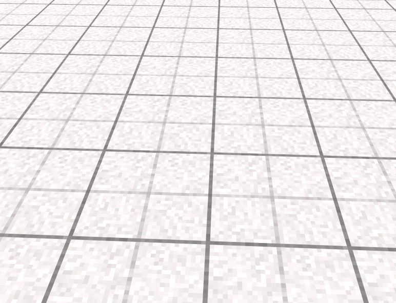

import WaterIcon from '../\_images/water_icon.png';

# Materials

SandBoxes ships with a number of materials that can be referenced by name, i.e. `generic`.

## generic (default)

## concrete

## grass

## moss

## dark_wood

## bark

## sand

## water

## pale_bricks

## bricks

## paving_stones

## metal_diamond_pattern

